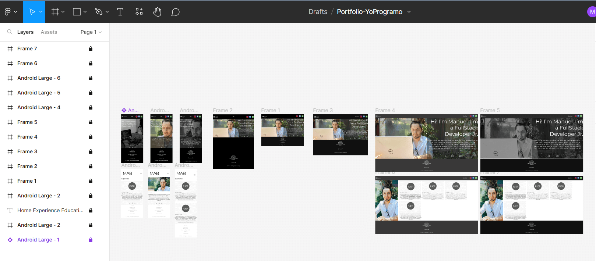
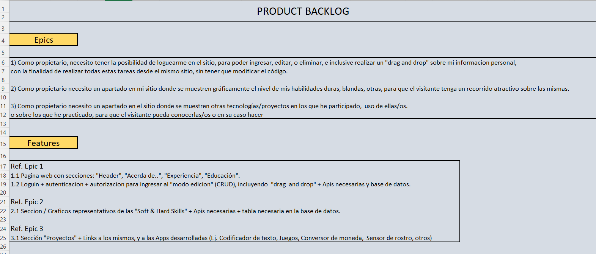
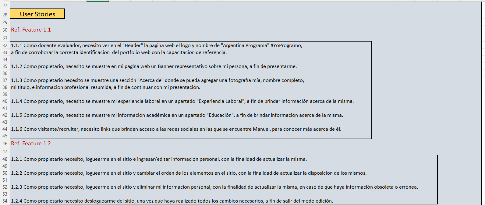
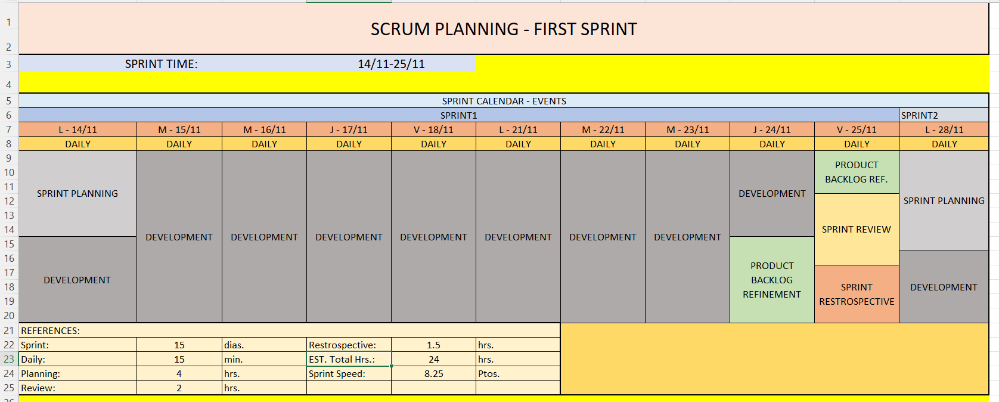
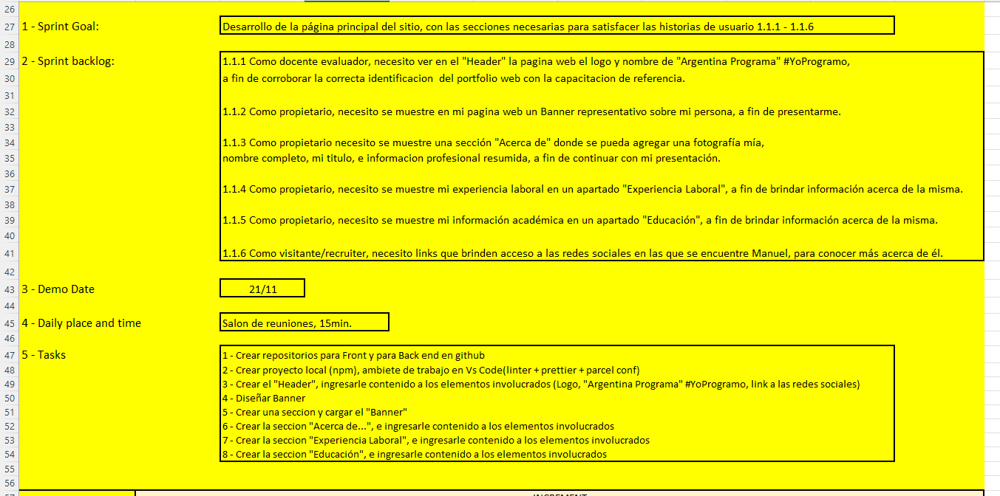
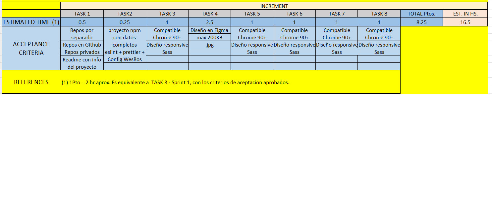

## Proyecto final ArgPrograma etapa YoProgramo
Src Code> https://github.com/m32795434/Portfolio-YoProgramo-MaquetadoFront 

>/> transcribiendo a angular!...

En el desafío del primer módulo de la capacitación debíamos aplicar la metodología SCRUM. Dado que es mi portfolio, me consideré en todas las posiciones que SCRUM determina. A saber: Product Owner, Scrum Master, Developer. Por tanto aunque parezca un poco redundante todo esto, lo apliqué solo a modo de práctica, y en cada posición consideré todos los aspectos que consideraría en caso de trabajar con un equipo real, teniendo que asumir alguna de dichas funciones. 
Actualmente continúo aplicando las características y funcionalidades adicionales que nos ofrece Github, tales como ["Projects", "Labels", "Issues", "Pull Requests", "Tags"]. Aunque parezca un poco <strong>"burocrático"</strong>, (ya que estoy jugando con esto en <b>solitario</b>), de esta forma llevo un correcto registro de todas las tareas, realizadas y a realizar, y considero este acercamiento es más eficiente.

Los archivos de informacion sobre el proyecto los van a encontrar en la carpeta /ProyectInfo en el directorio raiz.

Enlace al Figma:https://www.figma.com/file/OzmM9ZwWiCKJm0VOkrIZa5/Portfolio-YoProgramo?node-id=0%3A1&t=8uwZka9PgEAfaabS-1

## Algunas capturas:

<h2 style="text-align:center;">Digital Mockup</h2>

<h2 style="text-align:center;">App architecture</h2>

<h2 style="text-align:center;">Epics and Features</h2>

<h2 style="text-align:center;">Some User Stories</h2>

<h2 style="text-align:center;">First Sprint Planing</h2>

<h2 style="text-align:center;">SprintGoal, Backlog and Tasks</h2>

<h2 style="text-align:center;">Acceptance Criteria</h2>

